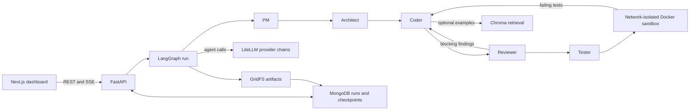

# CodeForge

A multi-agent AI platform that automates the software development life cycle. Describe an app in
plain English and five role-based agents — PM, Architect, Coder, Reviewer, Tester — collaborate
through a LangGraph workflow to produce a working, tested CRUD REST API, executed live in a Docker
sandbox and streamed to a dashboard.

Build plan in [docs/PHASES.md](docs/PHASES.md); the dashboard's design brief in
[docs/UI_BRIEF.md](docs/UI_BRIEF.md). Architecture and stack decisions live in `CLAUDE.md` — kept
out of this repo intentionally; ask a teammate for a copy.

Deployment preparation for Vercel plus a Docker-capable backend host is in
[docs/DEPLOYMENT.md](docs/DEPLOYMENT.md). The local `docker-compose.yml` and `./start.sh` remain
the development and demo path.

## Architecture



Runs pause for approval after requirements and design. The Reviewer and Tester can send a run
back to the Coder within a bounded loop; the sandbox executes the generated API and tests without
network access. MongoDB stores run state and per-iteration artifacts, which power stream replay
and the code Diff panel. The supported generation domain is single- and two-entity CRUD APIs.

After a run passes its tests, **Try API** lets the owner call its endpoints in a private,
15-minute sandbox. From that page, **Publish API** gives the owner a stable URL and a
one-time API key for server-side callers. Published data lives in a private Docker
volume until the owner unpublishes. The CodeForge backend and Docker host must remain
online; set `API_PUBLIC_BASE_URL` to an HTTPS backend origin for external access.
See [Hosted generated APIs](docs/HOSTED_APIS.md) for limits and lifecycle details.

## Prerequisites

- Docker Desktop
- Python 3.11
- Node.js 20+
- git

## Local setup

```bash
git clone https://github.com/MihirPatel2105/CodeForge.git
cd CodeForge
```

### Quick start

For a local demo, the repository includes a one-command launcher. It checks prerequisites,
starts Docker services, waits for the backend health check, runs the optional provider preflight,
and starts the Next.js dashboard on port 3001.

```bash
./start.sh --demo
```

Open <http://localhost:3001> and keep the terminal open while using CodeForge. The `--demo`
option checks that every agent has at least one reachable AI-provider fallback before starting
the dashboard. A normal development start skips that provider check:

```bash
./start.sh
```

Useful commands:

```bash
./start.sh --check   # verify prerequisites without changing anything
./start.sh --stop    # stop CodeForge services
```

Press `Ctrl-C` in the launcher terminal to stop the frontend and Docker services together.

### 1. Environment file

Each developer keeps their own `.env` — it is never committed.

```bash
cp backend/.env.example backend/.env
python3 -c "import secrets; print(secrets.token_urlsafe(48))"   # paste into JWT_SECRET
```

Add your own free-tier API keys. Groq is the primary provider; OpenRouter and Mistral back the
fallback chains. Do not share keys between team members — free tiers are rate-limited per account.

| Key | Where to get it |
|---|---|
| `GROQ_API_KEY` | [console.groq.com](https://console.groq.com) |
| `OPENROUTER_API_KEY` | [openrouter.ai](https://openrouter.ai) |
| `MISTRAL_API_KEY` | [console.mistral.ai](https://console.mistral.ai) — free tier, the last rung of every chain |

`CEREBRAS_API_KEY` and `GOOGLE_API_KEY` remain in the example for historical configuration,
but neither provider is currently in an agent fallback chain.

`MONGO_URI` defaults to the local `mongo` service docker-compose brings up — nothing else to do. It
can instead point at an Atlas M0 free-tier cluster — both are fine, it's a project-approved choice; the
connection-string form is commented above it in `.env.example`. Whichever you use, the test suite
always runs against local Mongo regardless of `MONGO_URI` (`tests/conftest.py` pins it), so it stays
fast and never touches a hosted cluster's free-tier limits.

**Email verification (optional).** Sign-up mails a one-time code, password resets mail a link, and
security-sensitive changes send a notice — all through `SMTP_USER`/`SMTP_PASSWORD` in `.env`. Leave
both blank and the backend logs a startup warning and falls back to one-step sign-up with no
verification, rather than making registration impossible. To turn it on: a Gmail address, then
Google Account → Security → 2-Step Verification → **App passwords** → generate one and use it as
`SMTP_PASSWORD` (not your normal Gmail password).

### 2. Start the stack

```bash
docker compose up -d
```

Brings up `mongo`, `backend` (:8000), and `langfuse` (:3000). First run pulls ~1GB of images.

### 3. Langfuse keys (second pass)

These do not exist until Langfuse is running, so this step comes after `compose up`:

1. Open <http://localhost:3000>, sign up, create an organization, then a project.
2. **Settings → API Keys → Create new API key.**
3. Copy both into `backend/.env` as `LANGFUSE_PUBLIC_KEY` and `LANGFUSE_SECRET_KEY`.

The secret key is displayed only once. Langfuse runs locally, so these keys are per-machine — one
developer's keys will not work for another.

### 4. Backend dev environment

Needed for tests, linting, and running uvicorn directly. Create the venv at `backend/.venv` so the
committed VS Code interpreter setting resolves.

```bash
cd backend
python3.11 -m venv .venv
source .venv/bin/activate
pip install -r requirements-dev.txt
cd .. && pre-commit install     # git hooks are not cloned; install once per clone
```

### 5. Frontend

```bash
cd frontend
npm install
npm run dev
```

The frontend is **not** part of docker-compose and runs separately. Port 3000 is taken by Langfuse,
so Next.js will offer 3001.

## Verify the setup

```bash
curl localhost:8000/health                            # {"status":"ok"}

cd backend && source .venv/bin/activate
pytest                                                # the full suite, offline and local
PYTHONPATH=. python scripts/smoke_llm.py              # completion + Langfuse trace
```

The smoke script makes one LiteLLM call through Groq and traces it to Langfuse — it verifies keys,
routing, and observability in one shot. Check the trace appears in the Langfuse UI.

## Evaluate the pipeline

The canonical evaluation is 10 frozen prompts, three repetitions, and both retrieval settings
(60 slots). It records acceptance levels, failure categories, timing, review-loop outcomes,
provider attempts, and RAG deltas. Check the planned work without contacting services:

```bash
cd backend
PYTHONPATH=. python scripts/evaluate.py --repeat 3 --dry-run
```

With MongoDB, the sandbox image, and LLM keys ready, run in quota-sized chunks:

```bash
PYTHONPATH=. python scripts/evaluate.py --repeat 3 --max-runs 2
```

Reusing the command resumes unfinished slots. The JSON and CSV files are written to
`backend/evaluation-results/` and ignored by Git; infrastructure failures and a provider-wide
429 before any completion are recorded but excluded from rates. If platform code or the sandbox
changes between chunks, start a new experiment with `--out-dir` pointing to a new directory.
Partial runs are not a full benchmark and should not be read as a RAG comparison.

To check quota and reachability for every rung of every chain — worth doing before a demo, since
free-tier limits are the usual reason a run dies mid-way:

```bash
docker compose exec backend python scripts/preflight.py
```

It exits non-zero if any agent has no working rung, so it can gate a script as well as inform a
human. Note that OpenRouter's free-models-per-day cap is the one number no endpoint exposes — the
script says so rather than printing a reassuring figure that measures something else.

## Notes

- **No hot-reload in the backend container.** `uvicorn` runs without `--reload`, so changes to
  `backend/app/` need `docker compose restart backend`. For active development, run uvicorn from
  the venv on the host instead.
- **After any `requirements.txt` change, rebuild:** `docker compose build backend`. The container
  mounts `backend/app` but bakes dependencies into the image, so new code arrives without its
  new packages and the container crash-loops on `ModuleNotFoundError`.
- `docker compose down` stops the stack; add `-v` to also wipe the Mongo and Langfuse volumes.

## Contributing

1. Fork the repository and create a branch off `main`.
2. Make your changes.
3. Open a pull request describing what changed and why.

## License

[MIT](LICENSE)
