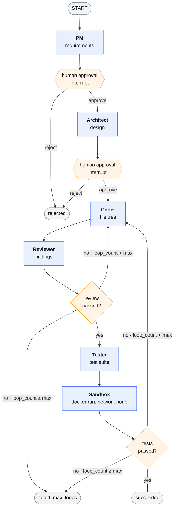

# AGENTS.md — Agent Specs & the Feedback Loop

Five agents + an orchestrator (LangGraph). Each agent = one SDLC phase, one prompt template, one
Pydantic output schema, one model chain. Agents are dumb functions over state: read `RunState`,
call the LLM, return a validated object, write it back. No agent calls Docker, Mongo, or SSE
directly.

---

## 1. Agent contract (all agents follow this shape)

```python
class BaseAgent:
    name: str
    output_schema: type[BaseModel]
    model_chain: list[str]          # from llm/registry.py, never hardcoded

    async def run(self, state: RunState) -> BaseModel:
        prompt = render(self.template, state)
        return await llm.structured(
            prompt=prompt,
            schema=self.output_schema,
            models=self.model_chain,
            trace={"run_id": state["run_id"], "agent": self.name,
                   "iteration": state["loop_count"]},
        )
```

Rules
- Output is **always** a validated Pydantic object via Instructor. Never raw text parsing.
- Prompts receive only what the agent needs — not the entire state dump. Context bloat is the
  fastest way to blow a free-tier TPM limit.
- Every agent has a system prompt stating its role, its output schema, and its hard constraints.

---

## 2. PM Agent — Requirements

**In:** `user_prompt`
**Out:** `Requirements`

```python
class Entity(BaseModel):
    name: str                    # "Book"
    fields: list[Field]          # name, type, required, default

class Requirements(BaseModel):
    project_name: str
    summary: str
    entities: list[Entity]       # 1–2 entities max (scope rule)
    operations: list[str]        # create, read, update, delete
    user_stories: list[str]
    out_of_scope: list[str]      # what it explicitly refused to build
```

Prompt rules
- Resolve vagueness with sensible defaults; do not ask the user questions.
- Enforce scope: if the request needs more than 2 entities or non-CRUD behaviour, trim it and
  list what was dropped in `out_of_scope`.
- Field types restricted to: `str`, `int`, `float`, `bool`, `datetime`, `list[str]`.

**Model chain:** `CHAINS["pm"]` in `backend/app/llm/registry.py` (see CLAUDE.md §5).
**Checkpoint:** human approval after this node.

---

## 3. Architect Agent — Design

**In:** `Requirements`
**Out:** `Design`

```python
class FileSpec(BaseModel):
    path: str                    # "main.py"
    purpose: str

class Design(BaseModel):
    collections: list[Collection]      # Mongo collection + Beanie Document fields + indexes
    endpoints: list[Endpoint]          # method, path, request_model, response_model, status
    files: list[FileSpec]
    notes: list[str]
```

Prompt rules
- Target stack is fixed: FastAPI + Beanie + MongoDB + pytest/httpx. Never propose alternatives.
- Target file structure: `main.py`, `models.py`, `schemas.py`, `database.py`, `test_main.py`.
- **Mandatory rule in the template:** every endpoint declares an explicit `response_model`;
  a raw Beanie `Document` is never returned, because Mongo's `_id` is an `ObjectId` and is not
  JSON-serializable. `id` is exposed as a `str`.
- REST conventions: plural paths, correct status codes (201 create, 204 delete, 404 missing).

**Model chain:** `CHAINS["architect"]` in `backend/app/llm/registry.py` (see CLAUDE.md §5).
**Checkpoint:** human approval after this node.

---

## 4. Coder Agent — Implementation

**In:** `Requirements`, `Design`, plus (on loop iterations) `ReviewResult` / `TestResult`
**Out:** `CodeOutput`

```python
class GeneratedFile(BaseModel):
    path: str
    content: str

class CodeOutput(BaseModel):
    files: list[GeneratedFile]
    changelog: list[str]         # on fix passes: what was changed and why
```

Prompt rules
- Writes the whole file tree, file by file, complete and runnable. No `# TODO`, no ellipses,
  no "rest of the code unchanged".
- RAG: retrieve 3–5 snippets from the ChromaDB curated library and inject them as reference
  patterns. Flag-controlled so the with/without delta can be measured.
- **Fix mode:** when `review` or `tests` contain failures, send only the failing findings and the
  affected files — not the full history. Rewrite only those files; keep everything else byte-identical.
- No network calls, no external services, no env vars in generated code. Mongo URI is always
  `mongodb://localhost:27017` (mongod runs inside the sandbox container).

**Model chain:** `CHAINS["coder"]` in `backend/app/llm/registry.py` (see CLAUDE.md §5). This
agent writes the most tokens per turn, so it carries the largest `max_tokens` budget and a
code-specialised cloud fallback. Cerebras was the intended primary until its free tier went
paid — expect Groq rate limits here first.

---

## 5. Reviewer Agent — Review

**In:** `Design`, `CodeOutput`
**Out:** `ReviewResult`

```python
class Finding(BaseModel):
    severity: Literal["blocking", "warning", "nit"]
    file: str
    line: int | None
    issue: str
    fix_hint: str

class ReviewResult(BaseModel):
    findings: list[Finding]
    passed: bool                 # True when no blocking findings
```

Fixed checklist in the prompt (keeps output consistent and measurable):
1. Does every endpoint declare a `response_model`? Is any raw Beanie `Document` returned?
2. Is `ObjectId` converted to `str` on the way out?
3. Are 404s handled for missing documents on get/update/delete?
4. Do the endpoints match the Design exactly (paths, methods, status codes)?
5. Are imports complete and file references consistent across the tree?
6. Is Beanie initialised on startup with all Document models registered?
7. Any obvious runtime error — undefined name, wrong await, sync call in async path?

Rules
- Output findings only. Never rewrite code — that's the Coder's job.
- `blocking` is reserved for "this will not run correctly". Style opinions are `nit`.

**Model chain:** `CHAINS["reviewer"]` in `backend/app/llm/registry.py` (see CLAUDE.md §5).

---

## 6. Tester Agent — Testing

**In:** `Design`, `CodeOutput`
**Out:** `TestOutput`, then `TestResult` after the sandbox runs

```python
class TestOutput(BaseModel):
    files: list[GeneratedFile]   # test_main.py (+ conftest.py if needed)

class TestResult(BaseModel):     # produced by the sandbox, not the LLM
    passed: bool
    total: int
    failed: int
    failures: list[TestFailure]  # test_name, assertion, traceback_tail
    stdout_tail: str
```

Prompt rules
- pytest + `fastapi.testclient.TestClient`, **always as a context manager** — entering the
  `with` block runs the app lifespan, which is what initialises Beanie. Tests are synchronous
  even though the app is async; see `docs/GENERATED_APP.md` §5 for why.
- One test per endpoint minimum, plus the 404 path for get/update/delete.
- Tests must be self-contained: create the data they assert on, clean up after.
- No network, no external fixtures, no sleeping.

**Model chain:** `CHAINS["tester"]` in `backend/app/llm/registry.py` (see CLAUDE.md §5).

---

## 7. Orchestrator — the LangGraph graph



The two edges returning to **Coder** are the cyclic feedback loop — the project's core
contribution. Both increment `loop_count`; neither is a silent retry, and each emits a
`loop.iteration` event so the dashboard renders the cycle visibly.

**Conditional routing**

```python
def after_reviewer(state) -> str:
    if state["review"].passed:                        return "tester"
    if loop_count_for(state, "reviewer") >= MAX_LOOPS: return "failed"
    return "coder"                                     # fix pass

def after_sandbox(state) -> str:
    if state["tests"].passed:                          return "done"
    if loop_count_for(state, "tester") >= MAX_LOOPS:    return "failed"
    return "coder"                                      # fix pass
```

Rules
- `loop_count` increments on **every return to the Coder**, from either source, and each
  `loop_history` entry records which one (`trigger: "reviewer" | "tester"`).
- **Each phase has its own budget** (split 2026-08-19): a slow-to-converge review used to be able
  to spend the *entire* shared budget before the Sandbox — whose verdict is the authoritative one
  — ever got a single attempt. `loop_count_for(state, trigger)` (`app/graph/routing.py`) counts
  each phase's own fix passes from `loop_history`, so `after_reviewer` and `after_sandbox` each get
  a full `MAX_LOOPS` independently rather than racing for one pool.
- `MAX_LOOPS = 3` per phase. On exhaustion the run ends as `failed_max_loops` with the last file
  tree and the outstanding findings preserved — a partial result, never a crash and never an
  infinite loop.
- Every node transition writes state via the `MongoDBSaver` checkpointer, so a crashed run resumes.
- Approval nodes interrupt the graph (`interrupt_before`); the API resumes the graph with the
  stored thread id when the user approves.
- Every transition also emits an SSE event — see `docs/STATE_AND_API.md`.

---

## 8. Prompt template rules

- Templates live in `backend/app/prompts/`, one file per agent. Never inline a long prompt in
  agent code.
- Every template ends with an explicit output-schema reminder; Instructor enforces it, but the
  reminder measurably cuts retries.
- Version templates (`pm_v1`, `pm_v2`) and record the version in state — prompt changes shift the
  metrics, and the report needs to say which version produced which numbers.
- The `_id` / `response_model` rule appears in **both** the Architect template and the Reviewer
  checklist. Redundancy is intentional: it is the predicted #1 failure mode.
